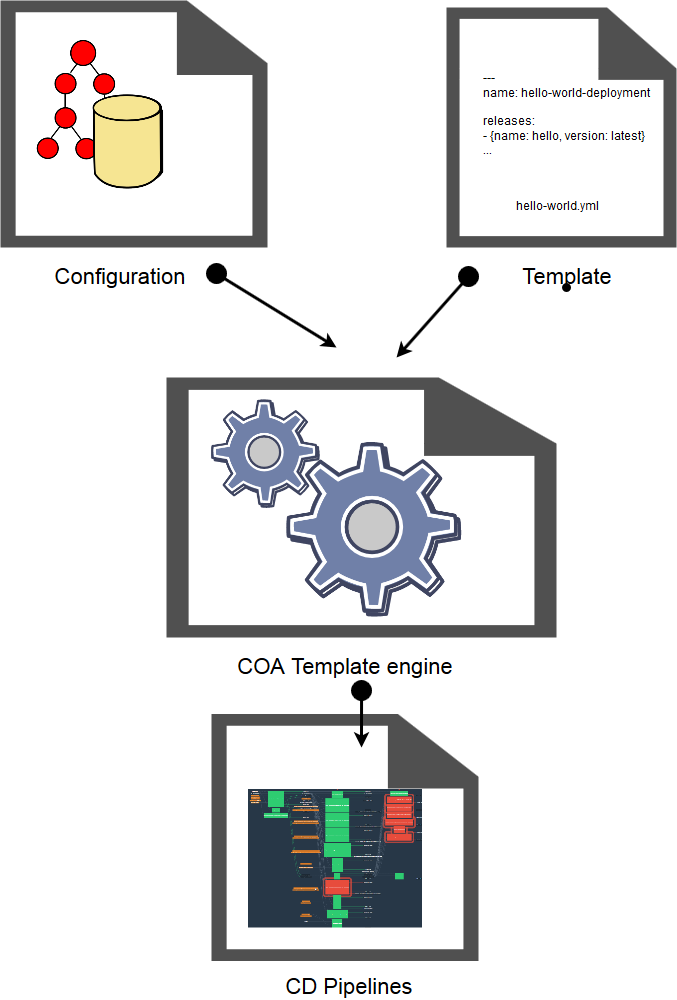

# cf-ops-automation (COA)

### Table of Contents

<!-- TOC initiated with [gh-md-toc](https://github.com/ekalinin/github-markdown-toc) -->

  * [Introduction](#introduction)
     * [Core principles](#core-principles)
     * [Model overview](#model-overview)
     * [Skills prereqs](#skills-prereqs)     
     * [Sample deployment topology](#sample-deployment-topology)
     * [Generated pipelines](#generated-pipelines)
  * [Template engine reference documentation](#template-engine-reference-documentation)
     * [Resource lifecycle overview](#resource-lifecycle-overview)
     * [Bosh deployment resources template format](#bosh-deployment-resources-template-format)
     * [Iaas specifics support](#iaas-specifics-support)
     * [Bosh cli v2 specific features support](#bosh-cli-v2-specific-features-support)
        * [ops-files](#ops-files)
        * [vars-files](#vars-files)
        * [cloud and runtime config](#cloud-and-runtime-config)
     * [git submodules](#git-submodules)
        * [enable deployment format (enable-deployment.yml)](#enable-deployment-format-enable-deploymentyml)
        * [deployment dependencies format (deployment-dependencies.yml)](#deployment-dependencies-format-deployment-dependenciesyml)
     * [Cloudfoundry application resources template format](#cloudfoundry-application-resources-template-format)
        * [enable-cf-app.yml file format](#enable-cf-appyml-file-format)
     * [pipeline auto-update](#pipeline-auto-update)
     * [Concourse team](#concourse-team)
     * [terraform](#terraform)
        * [file format](#file-format)
     * [delete lifecycle support](#delete-lifecycle-support)
        * [bosh deployment](#bosh-deployment)
        * [cf-app deployment](#cf-app-deployment)
     * [shared and private configuration](#shared-and-private-configuration)
   * [COA development](#coa-development)
      * [Status and roadmap](#status-and-roadmap)
      * [Running the Test Suite](#running-the-test-suite)
      * [Generating pipelines locally and uploading a test version](#generating-pipelines-locally-and-uploading-a-test-version)
      * [Local terraform development](#local-terraform-development)
      * [Submitting Pull Requests](#submitting-pull-requests)
      * [Releasing COA](#releasing-coa)
         * [Standard release](#standard-release)
         * [Hotfix release](#hotfix-release)
   * [FAQ](#faq)
      * [How to initialize a new bosh deployment template ?](#how-to-initialize-a-new-bosh-deployment-template-)
      * [How to enable a bosh deployment template ?](#how-to-enable-a-bosh-deployment-template-)
      * [How to upload a bosh release not available on bosh.io?](#how-to-upload-a-bosh-release-not-available-on-boshio)
      * [How to generate a tfvars in json from a yaml template?](#how-to-generate-a-tfvars-in-json-from-a-yaml-template)
         * [Sample](#sample)
      * [How to bootstrap pipelines to a new concourse](#how-to-bootstrap-pipelines-to-a-new-concourse)
         * [pre requisite](#pre-requisite)
      * [How to create a new root deployment](#how-to-create-a-new-root-deployment)
         * [pre requisite](#pre-requisite-1)
   * [Credits](#credits)


## Introduction

This repo provides a collaboration framework for operating cloudfoundry and services.

The goal is to automate most (if not all) interactive operations of Bosh/CF API/Iaas APIs through concourse pipelines, while keeping volume of boilerplate code low, and limit skills prereqs required to contribute services automation.

### Core principles

* foster **open-source** collaboration across operators through
   * automation of bosh/terraform best practices
   * **simplified operations** of large scale complex deployments (e.g. cloudfoundry + n dataservices incl. monitoring/alerting/logs ...):
      * portable distribution which bootstraps from raw Iaas with minimal external prereqs 
      * concourse & git as primary UIs for operators
      * consistent operations of multiple environments (e.g. preprod/prod-region1/prod-region2/...) 
      * scalability through multiple bosh directors
      * high avaibility through indepent regions support
      * offline/airgap support
  * **opiniated collaboration** framework
     * strict separation between template and configuration
       * template: shared across operation teams
       * configuration: specific to each operated environment
     * differentiated support for template authors and service operators:
       * feature branches, template release versions
  * **declarative idempotent** approach, leveraging:
    * terraform configurations (for Iaas, CF, K8S resources)
    * bosh deployment manifests 
    * cloudfoundry application manifests
  * convention-over-configuration
    * concourse pipelines are generated and updated from directory/file naming conventions
    * consolidated bosh release version management
* **diversity** of supported cloud and operators **customizations**
  * multiple iaas support (eg: openstack / vsphere / cloudstack)
  * rich yaml manifest templating support:
    * spiff, spruce enable leveraging bosh v1 legay manifests
    * vars & operators, bosh cli v2 interpolate enable leveraging current bosh v2 syntax
  * conditional activation of deployments 
  * extensibility through terraform providers 

### Skills prereqs

<!-- table initiated through https://www.tablesgenerator.com/markdown_tables# -->

COA framework strives to limit skills prereqs for each persona, which the following table summarizes

| Persona                | Skills                                                            |
| :----------------------| :-----------------------------------------------------------------|
| service operator       | git <br>concourse concepts (UI usage, no authoring as pipelines are generated)|
| template author        | git <br>bosh <br>terraform (\*) <br>cf app manifest (\*) <br>concourse-pipelines (\*) <br>k8s (\*)|
| COA framework developer | ruby <br>concourse <br>shell <br>bosh <br>terraform <br>git|

(\*) optional depending on contributed templates

### Model Overview

COA takes templates and configurations as inputs, and generates concourse pipelines as outputs. Generated template  automatically reload and execute. As a result, resources (Iaas, Bosh, CF) gets provisionned and operated through pipelines.

<!-- edit image source at https://www.draw.io/?lightbox=1&highlight=0000ff&edit=_blank&layers=1&nav=1&title=coab#Uhttps%3A%2F%2Fdrive.google.com%2Fuc%3Fid%3D1qaLM6Ca-3RerlEsQ-BEJHHfIYVWZdeVF%26export%3Ddownload -->

<p align="center">

 <em>Diagram inspired from <a title="Dreftymac [GFDL (http://www.gnu.org/copyleft/fdl.html), CC-BY-SA-3.0 (http://creativecommons.org/licenses/by-sa/3.0/) or CC BY 2.5 (http://creativecommons.org/licenses/by/2.5)], via Wikimedia Commons" href="https://commons.wikimedia.org/wiki/File%3ATempEngGen015.svg">Dreftymac</a>
</em>
</p>

* Templates are specified in a git repo (referred to as "paas-templates"). It contains a hierarchical structure with root deployment and nested deployment templates.
* Configurations are specified in a git repo (referred to as "secrets"). Their structure mimics the template structure, indicating which deployment template should instanciated. See  
* Generated pipeline triggers provisioning of resources whose credentials and secrets are pushed into a git repo (referred to as "secrets"). Plan is to move credentials to credhub.
 
A `root deployment` contains infrastructure to operate `nested deployment`s. 
* A root deployment typically contains Iaas prereqs, Bosh director and its cloud-config, DNS infrastrucure, private git server, Concourse, log collection, monitoring/alerting, credhub, etc... 
* Nested deployments are resources created by a root deployment. This typically include cloudfoundry, admin-ui, services, ... 


### Sample deployment topology

This section provides an overview of the deployment topology and bootstrapping process used by the Orange CloudFoundy skill center team. 
.

Nb: source is in the [plantuml](http://plantuml.com/) file: [bosh overview](docs/overview.puml), see [caching tips](https://stackoverflow.com/questions/32203610/how-to-integrate-uml-diagrams-into-gitlab-or-github)

The `inception`, `micro-depls`, `master-depls`, `ops-depls`, `expe-depls` are `root deployment`s in Orange CF skill center infrastructure (each associated with a dedicated bosh director)

The nested deployment model enables a split of responsibility as the operations team scales.

The plan is to open source the Orange's CF skill center team template git repo in the near future (once the remaining secrets get cleaned up), watch [paas-templates](https://github.com/orange-cloudfoundry/paas-templates) repo for incoming commits.


## Generated pipelines

This sections describes the pipelines that COA generates and loads into concourse. Some are singletons while others are templated and instanciated for each root deployment. 

### singletons

* [bootstraps-all-init-pipelines](concourse/pipelines/bootstraps-all-init-pipelines.yml): bootstraps all init pipelines 
* [micro-bosh-init-pipeline](concourse/pipelines/micro-bosh-init-pipeline.yml): !!! WIP !!! manages bosh-micro
* [sync-feature-branches](concourse/pipelines/sync-feature-branches.yml): manages a WIP branch based on develop and any feature branches  
* [sync-hotfix-branches](concourse/pipelines/sync-hotfix-branches.yml): manages a WIP branch based on master and any hotfix branches

### per-root-deployment 

* [cf-apps-pipeline](concourse/pipelines/templates/cf-apps-pipeline.yml.erb): manages cf-app associated to a root-deployment
* [depls-pipeline](concourse/pipelines/templates/depls-pipeline.yml.erb): manages deployments associated to a root-deployment
* [init-pipeline](concourse/pipelines/templates/init-pipeline.yml.erb): initializes all pipelines related to a root-deployment
* [news-pipeline](concourse/pipelines/templates/news-pipeline.yml.erb): notifies of new bosh release versions for a root-deployment  
* [s3-br-upload-pipeline](concourse/pipelines/template/s3-br-upload-pipeline.yml.erb): to upload boshrelease used by this root deployment to S3
* [s3-stemcell-upload-pipeline](concourse/pipelines/template/s3-stemcell-upload-pipeline.yml.erb): to upload stemcell used by this root deployment to S3
* [sync-helper-pipeline](concourse/pipelines/templates/sync-helper-pipeline.yml.erb): to ease secret repo management

The following diagram illustrates the sequence of pipeline generation  

.


## Template engine reference documentation

This section details the format supported by the templating engine in both the template repo and the secrets repo. 

### Resource lifecycle overview

The diagram below illustrates the concourse pipeline generation for two types of supported resources (Bosh deployments and CF apps). The diagram includes the main hooks that templating engine supports during the resources life cycle. 

. 


### Bosh deployment resources template format

For each boshrelease, when an `enable-deployment.yml` file is found in the secrets repo, it is going to spruce all template files in the corresponding template repo dir (template files need to end with ```-tpl.yml``` extension).

If a template directory contains hook scripts with specific name, then these scripts get executed in the following order :

  1: `post-generate.sh`: can execute shell operation or spruce task.
     **Restrictions**: as the post-generation script is executed in the same docker image running spruce, no spiff is available.
     Environment variables available:

      - GENERATE_DIR: directory holding generated files. It's an absolute path.
      - BASE_TEMPLATE_DIR: directory where `post-generate.sh` is located. It's an relative path. 

  2: `pre-deploy.sh`: can execute shell operation or spiff task.
     **Legacy support**: script named `pre-bosh-deploy.sh` are still supported  
     Environment variables available:
     
      - GENERATE_DIR: directory holding generated files. It's an absolute path. 
      - BASE_TEMPLATE_DIR: directory where `pre-deploy.sh` is located. It's an relative path. 
      - SECRETS_DIR: directory holding secrets related to current deployment. It's an relative path.

  3: `post-deploy.sh`: can execute shell operation (including curl).
     **Legacy support**: script named `post-bosh-deploy.sh` are still supported
     Environment variables available:
     
      - GENERATE_DIR: directory holding generated files. It's an absolute path. 
      - BASE_TEMPLATE_DIR: directory where `post-deploy.sh` is located. It's an relative path.
      - SECRETS_DIR: directory holding secrets related to current deployment. It's an relative path.

* to generate an additional errand step, in a `deployment-dependencies.yml` file, insert a key ```errands``` with a subkey named like the errand job to execute 

### Iaas specifics support
Manifest generation supports dedicated part to
Add directories (like openstack, cloudstack, etc...) for each specific iaas, in the template directory.
Set a `iaas-type` credential in secrets repo to match the directory name. 

  
### Bosh cli v2 specific features support
The newest bosh feature are not implemented in bosh cli v1. So some feature are only available to deployments using bosh cli v2.
This can be combined with iaas specifics support 
#### ops-files
By convention, all files in template dir matching `*-operators.yml` are used by `bosh-deployment` 
as ```ops-files``` inputs. Theses files **are not processed by spruce**. 
 
#### vars-files
By convention, all files in template dir matching `*-vars-tpl.yml` are processed by spruce and generate `*-vars.yml` files.
As spruce is no longer required, it is also possible to include vars files directly, files matching `*-vars.yml` are used by `bosh-deployment`  but ignored by spruce.
Theses files are used by ```bosh-deployment``` as ```vars-files``` inputs.

**Warning**: if there is a naming conflict between `*-vars-tpl.yml` and `*-vars.yml`, the `tpl` wins !

#### Cloud and runtime config
Rules for ops-files and vars-files here. 
To support operators and vars files for cloud and runtime config, we have to define addition convention, as there are in the same directory.
 - ```*cloud-operators.yml```: operators for cloud-config 
 - ```*cloud-vars.yml```: vars for cloud-config
 - ```*runtime-operators.yml```: operators for runtime-config
 - ```*runtime-vars.yml```: vars for runtime-config

**Migration v1 to v2 tips**: empty vars-files and ops-files are generated to avoid an error message

### git submodules
By default, git submodules are not checked out (this can be very time consuming). But some bosh releases require these 
  submodule. There is a mechanism to detect submodule for a release and include it only for this bosh release

#### enable deployment format (enable-deployment.yml)
this is expected to be an empty yaml file !

#### deployment dependencies format (deployment-dependencies.yml)

In `deployment-dependencies.yml`, it is possible to: 

- add secrets path to trigger the build:

``` yaml
        resources:
          secrets:
            extented_scan_path: ["ops-depls/cloudfoundry", "...."]
```
        
- choose a bosh cli version. By default, bosh cli v2 is used unless v1 specified in cli_version
        
``` yaml
        deployment:
          micro-bosh:
            cli_version: v1
            stemcells:
                ...
            releases:
                ...
```

Following is a `deployment-dependencies.yml` sample (should be placed in the boshrelease deployment dir):

``` yaml

---
deployment:
  micro-bosh:
    stemcells:
      bosh-openstack-kvm-ubuntu-trusty-go_agent:
    releases:
      route-registrar-boshrelease:
        base_location: https://bosh.io/d/github.com/
        repository: cloudfoundry-community/route-registrar-boshrelease    
      shield:
        base_location: https://bosh.io/d/github.com/
        repository: starkandwayne/shield-boshrelease        
      xxx_boshrelease:
        base_location: https://bosh.io/d/github.com/
        repository: xxx/yyyy
    errands:
      smoke_tests:       
```

### Cloudfoundry application resources template format

For each cf-application, when a `enable-cf-app.yml` file is found, it is going to spruce all files in the template dir ending with ```-tpl.yml```

If a template directory contains a `pre-cf-push.sh` file, then this script is run:
    - you are already logged in CF,
    - you have to download your binaries before uploading to CF

Environment variables available:
     
  - GENERATE_DIR: directory holding generated files. It's an absolute path. 
  - BASE_TEMPLATE_DIR: directory where `pre-cf-push.sh` is located. It's an relative path.
  - SECRETS_DIR: directory holding secrets related to current deployment. It's an relative path.
  - CF_API_URL: current application Cloud Foundry API url
  - CF_USERNAME: current Cloud Foundry application user
  - CF_PASSWORD: current Cloud Foundry application user password
  - CF_ORG: current Cloud Foundry application organization
  - CF_SPACE: current Cloud Foundry application space
  
It is also possible to use a `post-deploy.sh`, it is like a 'post-cf-push' script with an inconsistent name (we reuse the same concourse task)... To interact easily with cloudfoundry, previously listed environment variables are available.  

#### `enable-cf-app.yml` file format

``` yaml

---
cf-app:
  probe-apps-domains:
    cf_api_url: 
    cf_username: 
    cf_password: 
    cf_organization: 
    cf_space:
``` 

### pipeline auto-update

If a ci_deployments descriptor (i.e. a file called `ci-deployment-overview.yml`) is detected in secrets dir/<depls>, then an
auto-update job is generated.

### Concourse team
By default all pipelines deploy into `main` team. But it is possible to add a `team` key to specify another team. See File format bellow.

**WARNING**: `bootstrap` or `*-init` pipelines must belong to `main` team 

Pre-requisite: team to deploy must exist

### terraform

`ci-deployment-overview.yml` may include a `terraform_config` key to generate a terraform  pipeline.The `terraform_config` key
 must include a `state_file_path` key to indicate tfstate file path. It assumes that a spec dir is also included alongside
 the tfstate file.
  
#### file format

``` yaml

---
ci-deployment:
  ops-depls:
    target_name: concourse-ops
    terraform_config:
      state_file_path: ops-depls/tf-config-dir
    pipelines:
      ops-depls-generated:
        team: bootstrap #optional - Default: main
        config_file: xxxx/pipelines/ops-depls-generated.yml
        vars_files:
        - xxx/pipelines/credentials-ops-depls-pipeline.yml
        - xxx/ops-depls-versions.yml
      ops-depls-cf-apps-generated:
        config_file: xxx/pipelines/ops-depls-cf-apps-generated.yml
        vars_files:
        - xxx/pipelines/credentials-ops-depls-pipeline.yml
        - xxx/ops-depls-versions.yml
```

### delete lifecycle support

#### bosh deployment
It scans secrets/<root_deployment> for directories. If a ```enable-deployment.yml``` is found, deployment status is set 
to ```enabled```, otherwise to ```disabled```. 
```disabled``` deployment are going to be candidates for deletion. 

#### cf-app deployment
NYI

### shared and private configuration
we provide a new config mechanism shared across all root deployments. A [default](lib/config.rb#L11) will be provided by cf-ops-automation, 
but it is possible to override these values with a `shared-config.yml` file located in paas-template root directory. It 
also possible to override again with a `private-config.yml` file located in secrets root directory.


# COA development

## Status and roadmap

See [github issues](https://github.com/orange-cloudfoundry/cf-ops-automation/issues).

## Running the Test Suite

Prereqs:
- install ruby, gems and bundler (version >= 1.15.1):
   - `gem install bundler` 
- install dependent gems: `bundle install --path vendor/bundle`

If you are running the full test suite, some of the integration tests are dependent on the fly CLI.


To login to the Fly CLI and target the cf-ops-automation CI:

```sh
fly -t cf-ops-automation login
```

You will be prompted to select either the Github, UAA or Basic Auth authentication methods.

After these are set up, you will be able to run the test suite via:

```sh
bundler exec rspec
```

## Generating pipelines locally and uploading a test version 

While developing new pipelines, it might be easier to generate them locally and upload them manually to a concourse instance 

```bash
fly -t preprod login -u login -p password -c concourse-url
./scripts/generate-depls.rb --depls cloudflare-depls -t ../paas-template/ -p ../bosh-cloudwatt-preprod-secrets/ --no-dump -i ./concourse/pipelines/template/tf-pipeline.yml.erb 
SECRETS=../bosh-cloudwatt-preprod-secrets/ TARGET_NAME=preprod ./scripts/concourse-manual-pipelines-update.rb -dcloudflare-depls
```

Once pipelines are correct, commit, pipelines would perform automated deployment, see [scripts/concourse-generate-all-pipelines.sh](scripts/concourse-generate-all-pipelines.sh)  


## Local terraform development

In order to leverage IDE capabilities for terraform when editing TF config files (completion, syntax highlighting, etc.)
, a consistent local environment is required, with spruce templates interpolated, 
and tf config files merged from template and secrets repo.

This also enables local execution for `terraform plan` and `tf apply` providing shorter feedback cycles.

The `scripts/setUpTfDevEnv.sh` script partially automates the set up of such local environment:

```bash
source scripts/setUpTfDevEnv.sh
```

## Submitting Pull Requests

 * All pull requests should be made against the `develop` branch. Only Pull Requests based on this branch trigger automated builds.

## Releasing COA

### Standard release
Use cf-ops-automation pipeline to perform a release. You may need to bump the version using one of the following jobs: `major`, `minor` or `patch`.
Once the version is ok, simply launch `ship-it` job
 
### Hotfix release
This type of release requires manual work.

  1. checkouts the hotfix branch, and sets it to the expected tag
  1. fixes the issue 
  1. adds release description files :
     1. `hotfix.version`: add the expected release version. Format is <major>.<minor>.<patch>, e.g. 1.1.0 or 1.7.2
     1. `hotfix_release_notes.md`: the release note to publish on github   
  1. commits and push
  1. ensures `run-tests-for-hotfix-branch` is successful
  1. triggers `ship-hotfix` to publish the release on github


# FAQ

## How to initialize a new bosh deployment template ?
run `./init-template.sh`, and it creates empty placeholder.

## How to enable a bosh deployment template ?

`deployment-dependencies.yml` sample:

``` yaml

---
deployment:
  micro-bosh:
    stemcells:
      bosh-openstack-kvm-ubuntu-trusty-go_agent:
    releases:
      route-registrar-boshrelease:
        base_location: https://bosh.io/d/github.com/
        repository: cloudfoundry-community/route-registrar-boshrelease    
      shield:
        base_location: https://bosh.io/d/github.com/
        repository: starkandwayne/shield-boshrelease        
      xxx_boshrelease:
        base_location: https://bosh.io/d/github.com/
        repository: xxx/yyyy
    errands:
      smoke_tests:        
```

## How to upload a bosh release not available on bosh.io?
use ```deploy.sh``` script like [this](ops-depls/template/deploy.sh) to manually upload release.
```deploy.sh``` use bosh cli v2 syntax.

## How to generate a tfvars in json from a yaml template?
You can use spruce embedded with post-generate.sh to do it !
See [post-generate.sh](micro-depls/terraform-config/template/post-generate.sh) script t

### Sample

There is no yet public template sample. Orange employees can have a look to the [post-generate.sh](micro-depls/terraform-config/template/post-generate.sh) in the private paas-template repo.

## How to bootstrap pipelines to a new concourse

simply run [concourse-bootstrap.sh](scripts/concourse-bootstrap.sh) with the appropriate environment variable set. It loads the
```bootstrap-all-init-pipelines``` pipeline and triggers it.  


```
SECRETS=<path_to_your_secret_dir> FLY_TARGET=<your_target> ./concourse-bootstrap.sh
```

### pre requisite
The following tools are required to run [concourse-bootstrap.sh](scripts/concourse-bootstrap.sh)
 - git 
 - fly, the concourse CLI
    - Login to concourse in main team


## How to create a new root deployment

To setup a new paas-template repo, a new secrets repo or to add a new root deployment, you can run 
[create-root-depls](scripts/create-root-depls.rb) script to create empty files.

### pre requisite
The following tools are required to run [create-root-depls](scripts/create-root-depls.rb)
 - ruby

# Credits

This repo was inspired by great work shared in
 * https://github.com/alphagov/paas-cf
 * https://github.com/cloudfoundry/buildpacks-ci/ 
